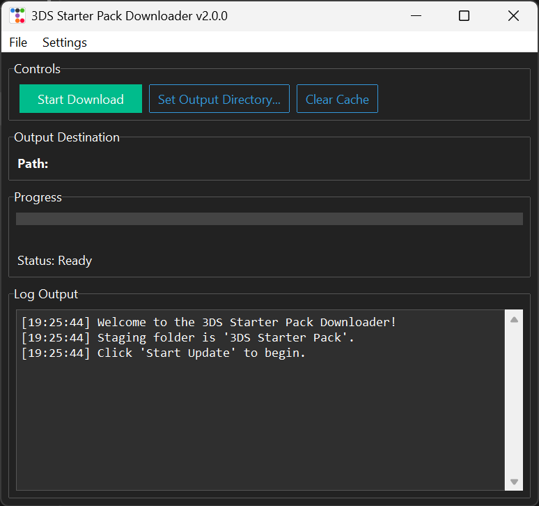

# 3DS Starter Pack Downloader (3DS-SPDL)

<div style="text-align: center;">
  
</div>

A streamlined GUI tool for downloading essential files needed to finalize your Nintendo 3DS custom firmware setup.

## What is this?

This Python GUI application automatically downloads the latest versions of core files required for the "Finalizing Setup" step when installing custom firmware on your 3DS console. It eliminates the need to manually hunt down individual releases from multiple GitHub repositories and organizes them for you.

## What gets downloaded?

* **Luma3DS**: The latest custom firmware (`boot.firm`).
* **GodMode9**: The file system access tool (`GodMode9.firm`) and its useful scripts.
* **Finalize**: The required helper files for setup completion (`x_finalize_helper.firm` and `finalize.romfs`).

All files are automatically organized in the proper SD card structure, ready to copy directly to your 3DS.

## Requirements

* Windows, macOS, or Linux
* An internet connection

### For Executable (Windows)

* No other requirements.

### For Python Script (All Platforms)

* Python 3.x
* The `requests` and `ttkbootstrap` Python libraries. Install them with:
```bash
pip install requests ttkbootstrap
```

## Usage

### Option 1: Executable (Windows)

1. Download `3DS-SPDL.exe` from the [Releases](https://github.com/yourusername/yourrepo/releases) page.
2. Run the executable.
3. Click **"Start Download"**.

### Option 2: Python Script (All Platforms)

1. Ensure you have met the Python script requirements (see above).
2. Run the script from your terminal:
```bash
python 3DS-SPDL.py
```

3. Click **"Start Download"**.

## Features

* **Graphical User Interface**: A simple, modern interface. No command line needed.
* **Smart Caching**: Avoids GitHub API rate limits by caching release info for 24 hours.
* **Cache Management**: A "Clear Cache" button lets you force a fresh download of all files.
* **GitHub PAT Support**: You can add your GitHub Personal Access Token via the **Settings > GitHub PAT...** menu to increase API rate limits. The token is saved securely in `gui_updater_config.json`.
* **Direct-to-SD Copy**: Use the **"Set Output Directory..."** button to select your SD card root. The app will automatically copy the files to it after downloading.
* **Clean Organization**: All files are placed in the correct SD card structure (e.g., `/luma/payloads`, `/gm9`) inside the `3DS Starter Pack` staging folder.
* **Live Progress**: A full log window and progress bar show exactly what's being downloaded and organized.

## Output

The script first downloads and organizes all files into a local folder named `3DS Starter Pack`.

If you have **not** set an Output Directory, you can simply copy the contents of this `3DS Starter Pack` folder to the root of your SD card.

If you **have** set an Output Directory (like your SD card), the app will automatically merge/overwrite all the downloaded files into that destination for you.

## License

This project is licensed under the MIT License.

## Support My Work

If you find this project useful, please consider supporting me by buying me a coffee!

<a href="https://www.buymeacoffee.com/yourusername" target="_blank">
  
</a>